# 🤖 MISTRAL OCR IMPLEMENTATION PLAN

## 🎯 **WHY MISTRAL OCR IS ESSENTIAL**

### **Current Text Extraction Problems**
❌ **Text-only approach sees**: `"ISIN: XS2993414619 // Valorn.: 140610687"`  
❌ **Cannot understand**: Which number is market value vs reference number  
❌ **Misses context**: Table structure, column relationships, visual layout  
❌ **Gets confused**: IBANs vs ISINs, Valor numbers vs market values  

### **Mistral OCR Visual Understanding**
✅ **Sees PDF like human**: Recognizes tables, headers, data relationships  
✅ **Understands context**: "Market Value" column vs "ISIN" column  
✅ **Spatial awareness**: Which CHF amount belongs to which security  
✅ **Pattern recognition**: Distinguishes between different number types  

## 🔄 **COMPLETE INTELLIGENT WORKFLOW**

```mermaid
graph TD
    A[📄 PDF Upload] --> B[🖼️ PDF to Images]
    B --> C[🤖 Mistral Vision API]
    C --> D[📊 Structured JSON Data]
    D --> E[🧠 AI Validation Agents]
    E --> F[🎨 Human Annotation Interface]
    F --> G[📈 Learning System]
    G --> H[🎯 99.9% Accuracy]
```



### **Step-by-Step Process**

#### **1. 📄→🖼️ Image Conversion**
- Convert PDF pages to high-quality PNG images
- **Current Issue**: GraphicsMagick dependency resolved with pdf2pic

#### **2. 🖼️→🤖 Mistral Vision Processing**
- Send images to Mistral Vision API with structured prompt
- **Prompt**: "Extract financial securities table with ISIN, market values, percentages"
- **Output**: Structured JSON with clear field mapping

#### **3. 📊→🧠 AI Agent Validation**
- **Agent 1**: ISIN validation (format, checksum, country codes)
- **Agent 2**: Value validation (reasonable ranges, currency conversion)  
- **Agent 3**: Cross-reference validation (totals match, percentages add up)
- **Agent 4**: Anomaly detection (outliers, missing data)

#### **4. 🧠→🎨 Human Annotation**
- Visual interface shows PDF with extracted data overlay
- **6 Annotation Tools**:
  - 📋 Table Headers (mark column types)
  - 📊 Data Rows (mark security boundaries)
  - 🔗 Field Connections (link ISIN to value)
  - ✨ Error Highlighting (mark mistakes)
  - ✏️ Text Corrections (fix OCR errors)
  - 🔄 Relationship Mapping (define data relationships)

#### **5. 🎨→📈 Learning System**
- Store human corrections as training patterns
- Update extraction algorithms based on feedback
- Improve accuracy with each document processed
- Build domain-specific knowledge base

## 🔧 **CURRENT IMPLEMENTATION ISSUES**

### **Issue 1: Mistral OCR Not Working**
**Problem**: System falling back to text extraction instead of using Mistral Vision
**Root Cause**: GraphicsMagick dependency caused fallback to be permanent
**Solution**: Fix the condition check in Smart OCR system

### **Issue 2: Missing Mistral API Integration**
**Problem**: Mistral Vision API not properly integrated
**Root Cause**: API key configuration and image processing pipeline
**Solution**: Complete Mistral integration with proper image handling

### **Issue 3: No AI Agent Validation**
**Problem**: No intelligent validation of extracted data
**Root Cause**: Missing agent system for data quality checks
**Solution**: Implement multi-agent validation pipeline

## 🚀 **IMPLEMENTATION PLAN**

### **Phase 1: Fix Mistral OCR Integration** (Priority 1)
1. ✅ Fix image conversion pipeline (pdf2pic working)
2. 🔄 Enable Mistral Vision API calls
3. 🔄 Create structured extraction prompts
4. 🔄 Test with Messos PDF

### **Phase 2: AI Agent Validation** (Priority 2)  
1. 🔄 ISIN validation agent
2. 🔄 Value validation agent
3. 🔄 Cross-reference agent
4. 🔄 Anomaly detection agent

### **Phase 3: Enhanced Annotation** (Priority 3)
1. ✅ Visual annotation interface (working)
2. 🔄 PDF overlay with extracted data
3. 🔄 Correction workflow integration
4. 🔄 Real-time accuracy feedback

### **Phase 4: Learning Integration** (Priority 4)
1. ✅ Pattern storage system (working)
2. 🔄 Human correction learning
3. 🔄 Algorithm improvement
4. 🔄 Domain knowledge building

## 📊 **EXPECTED RESULTS WITH MISTRAL OCR**

### **Current vs Expected**
| Metric | Current (Text) | Expected (Mistral) |
|--------|----------------|-------------------|
| **ISIN Detection** | 39 ISINs | 39 valid ISINs |
| **Value Extraction** | Random values | Correct CHF amounts |
| **Accuracy** | ~30% | ~94%+ baseline |
| **Data Structure** | Flat list | Proper table relationships |
| **Context Understanding** | None | Full spatial awareness |

### **Messos PDF Expected Output**
```json
{
  "securities": [
    {
      "isin": "XS2993414619",
      "name": "RBC LONDON 0% NOTES 2025-28.03.2035",
      "market_value_chf": 97700,
      "currency": "USD",
      "nominal": 100000,
      "percentage": 0.50,
      "maturity": "2035-03-28",
      "confidence": 95
    }
    // ... 38 more securities
  ],
  "total_portfolio_value": 19464431,
  "accuracy": 94.5,
  "extraction_method": "mistral-vision-ocr"
}
```

## 🎯 **NEXT STEPS**

1. **Fix Mistral Integration** - Enable actual Mistral Vision API calls
2. **Test with Real PDF** - Process Messos PDF through Mistral
3. **Implement Agents** - Add intelligent validation layer
4. **Human-in-Loop** - Connect annotation corrections to learning

The key insight is that **visual AI (Mistral OCR) + intelligent agents + human corrections = 99.9% accuracy**. Text extraction alone cannot achieve this level of understanding.